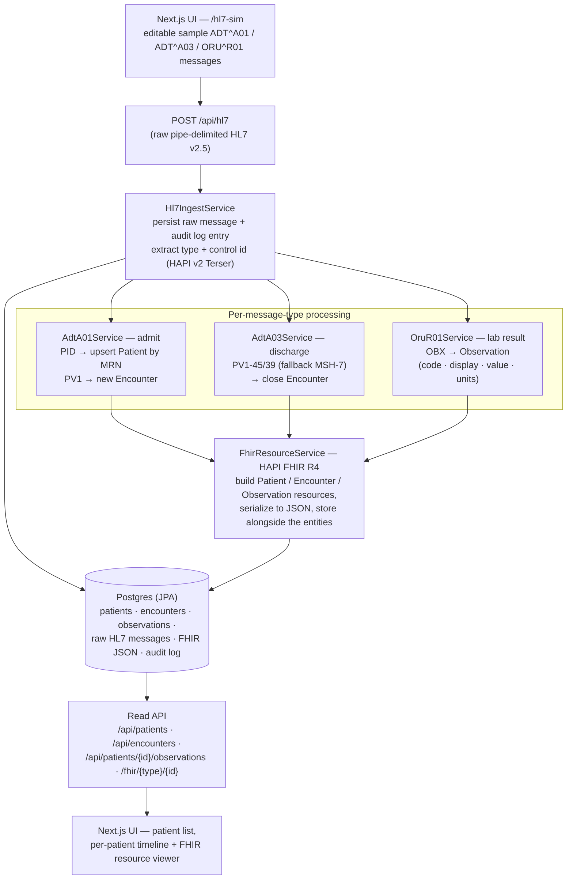

# hospital-in-a-box

A self-contained simulation of the most common hospital integration task: ingest **HL7 v2.5** messages (ADT admits/discharges, ORU lab results), transform them into **FHIR R4** resources, store both, and show the patient's story on a timeline — *admitted → labs posted → discharged*. Spring Boot + HAPI (v2 and FHIR) + Postgres + a Next.js UI, all wired together with one `docker compose up`.

## Why it exists

Every hospital runs on HL7 v2 feeds, and every modern health-data system wants FHIR. The unglamorous work of healthcare interoperability is the bridge between the two: parsing pipe-delimited v2 segments correctly, mapping them onto FHIR resources, and keeping an auditable record of every message that came through. This repo is that bridge in miniature — small enough to read in a sitting, real enough to use the same libraries (HAPI) production integration engines are built on.

## Architecture



Unrecognized message types are still persisted and audited — they just skip the processing dispatch. A parse or processing failure is recorded on the message row (`PROCESS_FAILED` + error) rather than lost.

## The v2 → FHIR mapping

| HL7 v2.5 input | Segments read | FHIR R4 output |
|---|---|---|
| `ADT^A01` (admit) | `PID-3` MRN · `PID-5` name · `PID-7` DOB · `PID-8` gender · `PV1` visit | `Patient` (MRN as identifier, upserted — repeat admits don't duplicate) + `Encounter` (in progress) |
| `ADT^A03` (discharge) | `PV1-45` discharge time, falling back to `PV1-39`, then `MSH-7` | The matching `Encounter` closed with an end time |
| `ORU^R01` (lab result) | `PATIENT_RESULT/ORDER_OBSERVATION/OBSERVATION/OBX-3` code/display · `OBX-5` value · `OBX-6` units | `Observation` linked to the patient |

Field access uses HAPI's `Terser` with explicit segment paths — the mapping is readable directly in each service class, which is the point: this repo is meant to be *read*.

## Running it

```bash
docker compose up          # Postgres :5432 · Spring Boot API :8080 · Next.js UI :3000
```

Open http://localhost:3000 — the **HL7 simulator** page lets you edit and send the sample admit/discharge/lab messages, then watch the patient appear on the timeline with their FHIR resources.

Backend tests (JDK 17+ required — Lombok will fail cryptically on Java 8):

```bash
cd backend && mvn test    # 6 tests: parsing, A01/A03/R01 mapping, timeline assembly
```

## Honest scope

This is a teaching-scale model of an integration engine, not one you'd deploy:

- **HTTP ingestion only** — real v2 feeds arrive over MLLP; the simulator page stands in for the sending system.
- **No ACK/NACK protocol** — a malformed message is recorded and flagged, not negotiated with the sender.
- **Three message types**, v2.5 only. The dispatch structure makes adding more a matter of one service class each.
- **FHIR resources are stored and served by id** (`GET /fhir/{resourceType}/{id}`) — it is not a full FHIR server (no search, no `_history`).

## License

MIT
